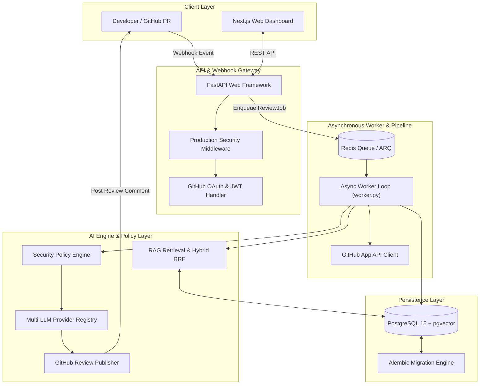
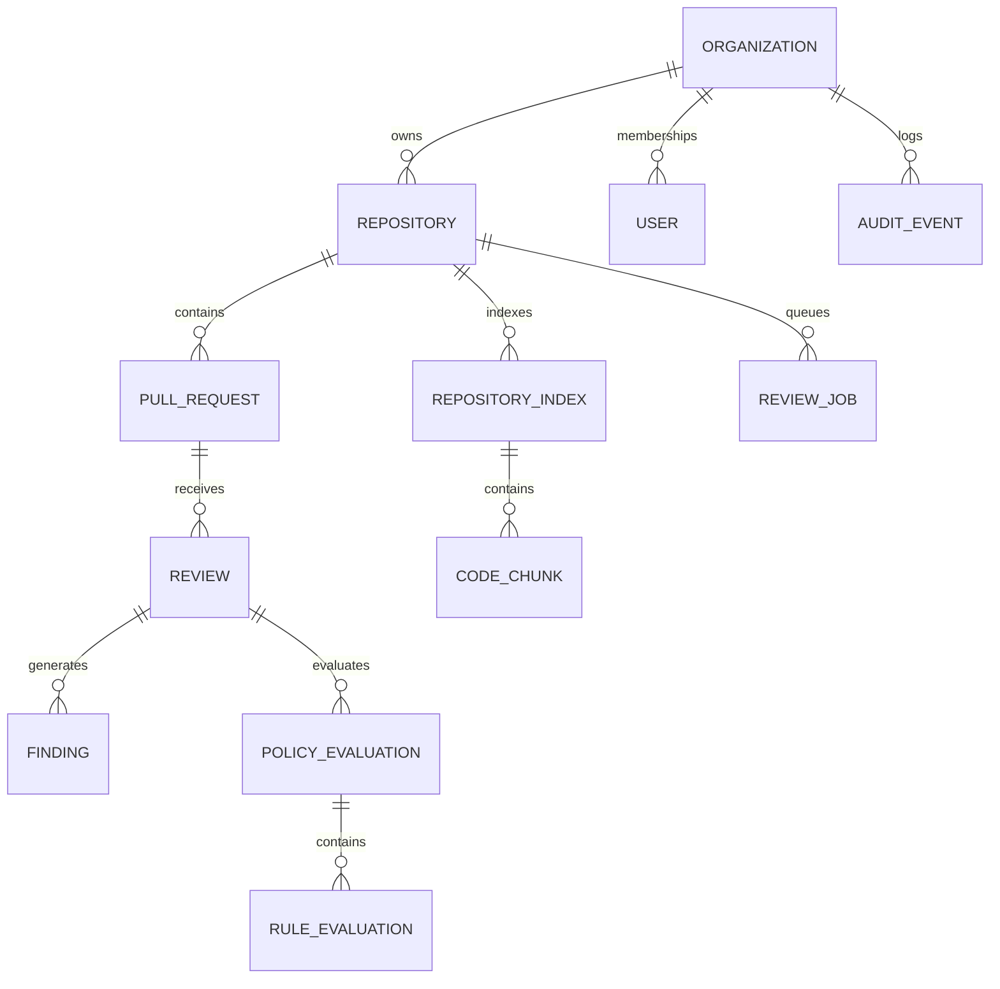

# CodeSage AI — System Architecture & Technical Specifications

This document provides a deep architectural overview of **CodeSage AI**, detailing component design, data flows, database models, RAG retrieval mechanics, Policy Engine rules, and multi-LLM integration.

---

## System Architecture Overview

CodeSage AI is structured as a unified monorepo with an asynchronous microservices-capable pattern:



---

## Key Subsystems

### 1. Asynchronous Review Pipeline & Delivery Tracker
- **FastAPI Webhook Handler**: Receives `push` and `pull_request` webhooks, verifying `X-Hub-Signature-256` HMAC signatures using timing-safe comparisons (`hmac.compare_digest`).
- **Delivery Tracker**: Maintains an LRU memory cache tracking `X-GitHub-Delivery` values to reject duplicate webhooks before payload parsing.
- **Async Queue & Worker Loop**: Enqueues `ReviewJob` records into Redis or an in-memory queue. The worker process (`app/worker.py`) manages job lifecycle states (`queued` $\rightarrow$ `running` $\rightarrow$ `completed` / `retry` / `dead_letter`) with exponential backoff.

### 2. Repository Intelligence & RAG Retrieval
- **Language-Aware Chunker**: Parses source files into AST and regex boundaries across Python, JS/TS/TSX, Java, and Go.
- **pgvector Vector Database**: Persists embeddings (`text-embedding-004`) alongside source code chunks with `CASCADE` deletion upon index updates.
- **Hybrid RRF Search Engine**: Combines Reciprocal Rank Fusion ($1/(k + r)$) across lexical keyword queries and vector similarity, imposing token budgets and generating line-level citations.

### 3. Security Policy Engine
- **Precedence Hierarchy**: Evaluates repository policies via `.codesage.yml` $\rightarrow$ DB Overrides $\rightarrow$ System Defaults.
- **Deterministic Rules Pack**:
  - `hardcoded-secrets`: Regex pattern matcher with secret redaction (`sec_1234************`).
  - `debug-code`: Detects leftover `print()`, `console.log()`, `debugger`, and `pdb.set_trace()`.
  - `dependency-changes`: Identifies dependency file updates (`requirements.txt`, `package.json`, `go.mod`).
  - `missing-tests`: Flags production code modifications missing corresponding unit test updates.
- **Finding Deduplication**: Computes SHA-256 fingerprints across rule key, file path, line number, and message to deduplicate findings.

### 4. Multi-LLM Provider Registry & Prompts
- **Abstracted Provider Interface**: Modular driver interface (`app/services/llm_providers/`) supporting Google Gemini (`gemini-2.5-flash`), OpenAI (`gpt-4o`), and Anthropic (`claude-3-5-sonnet`).
- **Prompt Versioning**: Database-driven prompt templates with variable replacement and automatic fallback.
- **Cost & Usage Tracking**: Logs request counts, prompt tokens, completion tokens, estimated USD cost, and latency per AI invocation.

### 5. Analytics & Audit Logging
- **Engineering Insights Service**: Computes real-time repository counts, review velocity, finding breakdowns, AI token usage, and queue success rates.
- **Sanitized Audit Log**: Records `user.login`, `user.logout`, `repository.indexed`, `policy.updated`, `review.completed`, and `github.review_published`. Automatically scrubs sensitive keys (`token`, `secret`, `password`, `authorization`, `api_key`).

---

## Database ER Diagram (SQLAlchemy 2.0)



---

## Alembic Migration Lineage

```text
001_initial_schema (Repositories, Pull Requests, Reviews, Findings, Webhook Deliveries)
       ↓
002_review_jobs_schema (ReviewJobs Queue Table)
       ↓
003_phase_4c_auth_schema (Users, Organizations, Memberships, Installations)
       ↓
004_phase_5a_ai_schema (AI Providers, Prompts, Usage, Model Configurations)
       ↓
005_phase_5b_repository_intelligence (Repository Indexes & Code Chunks with pgvector)
       ↓
006_phase_5c_policy_engine (Review Policies, Rules, Policy & Rule Evaluations)
       ↓
007_phase_5d_analytics_audit (Audit Events Schema) [HEAD]
```
